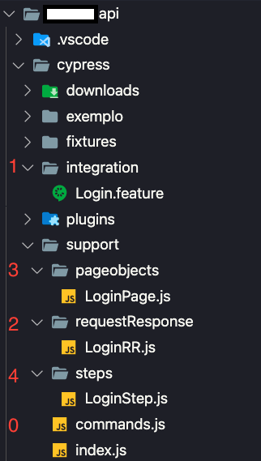

<!--  -->
## Arquitetura do projeto API ⚙️
<p align="center">
  
</p>

0. O arquivo commands mantém todos os mecânismos de requisição (POST, GET, PUT...).

```console
  ../commands.js
```

```javascript
  Cypress.Commands.add('requestPost', (url, path, body, token = null) => {
    return cy.request({
        method: 'POST',
        url: `${Cypress.config(`${url}`)}${path}`,
        body: body,
        auth: {
            bearer: token
        }
    }).then(responseRequest => {
        console.log(`Retorno serviço ${path}`)
        console.log(responseRequest)
        return new Promise(resolve => {
            resolve(responseRequest)
        })
    });
});
```
1. A pasta Integration é onde todo o BDD fica concentrado.
* [Leitura recomendada](https://tradersclub.atlassian.net/wiki/spaces/TRADERSCLU/pages/1776517127/Utilizando+BDD).

```console
  ../integration/Login.feature
```

```bdd
#language:pt

Funcionalidade: Login

    Cenario: Realizar login com sucesso
        Dado que eu faca a requisicao para o endpoint v1 auth login
        Entao espero o retorno "200"
```

2. A pasta requestResponse é responsável por todo objeto utilizado no request e no response, ou seja, a pasta requestResponse é onde fica todos os "contratos" dos endpoints.

```console
  ../requestResponse/LoginRR.feature
```

```javascript
export const requestLogin = (login_id,password) => {
    let obj = {}
    obj.login_id = login_id,
    obj.password = password
    return obj;
};

export const responseLogin = (login) => {
    let obj = {}
    obj.data = login.body.data
    obj.data.token = login.body.data.token
    obj.data.user_id = login.body.data.user_id
    obj.status = login.status
    return obj
};
```

3. A pasta pageObjects é a responsável por validar o objeto de requisição e em seguida fazer a requisição caso o objeto esteja correto.

```console
  ../pageObjects/LoginPage.feature
```

```javascript
/// <reference types="cypress" />

import { requestLogin } from '../requestResponse/LoginRR'

export const logar = (usuario = Cypress.env("usuario"), senha = Cypress.env("senha")) => {
    let bodyLogin = requestLogin(usuario, senha)
    return cy.requestPost('baseUrlV1','/v1/auth/login', bodyLogin)
}
```

4. steps, talvez a pasta mais importante, pois é responsável por unir o cenário descrito(1.) e o código para requisição do endpoint (3.). Nessa etapa também é feito a validação do objeto de retorno, garantindo que em caso de mudança tenhamos o "histórico" do response dos endpoints.

```console
  ../steps/LoginStep.js
```

```javascript
/* global Given, When, Then */

import { logar } from  '../pageobjects/LoginPage'
import { responseLogin } from '../requestResponse/LoginRR'

let loginRes = null;

Given("que eu faca a requisicao para o endpoint v1 auth login", () => {
    logar()
        .then(res => {
            loginRes = responseLogin(res);
        });
});

Then("espero o retorno {string}", (statusCode) => {
    expect(parseInt(statusCode)).equal(loginRes.status)
});
``` 
